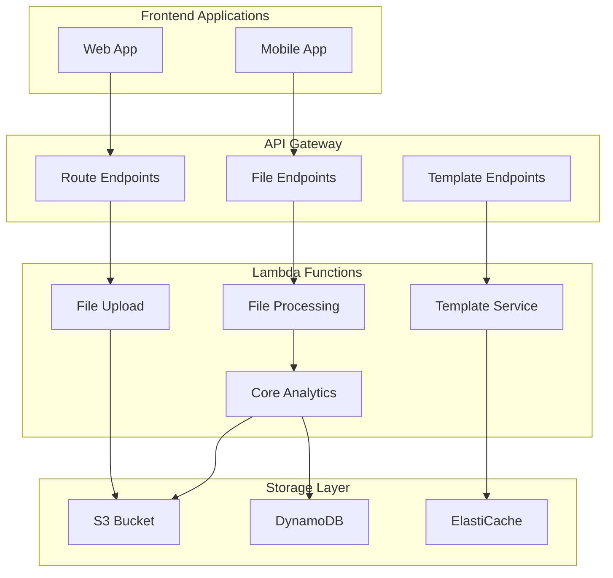

# Phase 2.4: Advanced Route Management (MVP)

**Version:** 1.0  
**Date:** December 30, 2025  
**Dependencies:** Phase 2.3 (Ride Management)  
**Target Completion:** Q2 2026  
**Priority:** High

## Phase 2.4 Scope Guarantee

**Phase 2.4 delivers route file storage, core analytics, and club-scoped templates only.** Any feature listed as "Deferred" is explicitly non-blocking for Phase 2.4 delivery.

This phase focuses on building solid infrastructure foundations rather than comprehensive feature coverage.

## Executive Summary

Phase 2.4 establishes the route management infrastructure for Sydney Cycles, transforming the basic waypoint system into a file-based route system with core analytics and club template libraries. This MVP phase prioritizes architectural foundations and essential functionality over advanced features.

**Key Deliverables (MVP):**
- GPX file upload, storage, and processing pipeline
- Core route analytics (distance, elevation, basic profiles)
- Club-scoped route template system
- Secure file download and sharing within clubs
- Foundation for future community and integration features

**Deferred to Future Phases:**
- Advanced analytics and visualizations *(Status: Contract only)*
- Weather/traffic/POI integrations *(Status: Contract only)*
- Community features (ratings, reviews, public sharing) *(Status: Contract only)*
- Direct platform exports (Strava, Garmin) *(Status: Contract only)*

## Business Context

### Current State (Post Phase 2.3)
- ✅ Basic route structure with waypoints and meeting points
- ✅ Route metadata (name, distance, difficulty, estimated time)
- ✅ Route authorization and access controls
- ✅ Integration with ride management system

### Business Drivers
1. **Enhanced User Experience**: Rich route information improves ride planning
2. **Knowledge Sharing**: Clubs can build and share route libraries
3. **Safety Improvements**: Detailed route information reduces navigation risks
4. **External Integration**: Seamless integration with popular cycling apps
5. **Data-Driven Insights**: Route analytics inform better ride planning

### Success Metrics (Measurable)
- **File Upload Success Rate**: >99% of GPX uploads complete successfully
- **Route Template Creation**: 50+ templates created per active club within 3 months
- **Template Usage**: 40% of new rides use existing templates
- **File Processing Time**: <2 minutes average for typical GPX files
- **User Adoption**: 60% of ride leaders upload at least one GPX file

**Measurement Methods:**
- `RouteFile.processingStatus = 'completed'` for upload success
- `RouteTemplate.usageCount` for template adoption
- `Ride.route.sourceType = 'template'` for template usage tracking

## Route Concepts & Terminology

### Core Route Concepts

To maintain clarity throughout the system, Phase 2.4 establishes three distinct route concepts:

#### 1. RouteDefinition
**Purpose**: Logical route used by rides and templates
- Contains waypoints, meeting points, and basic metadata
- Used directly by rides for navigation
- Can reference a RouteFile for enhanced data

#### 2. RouteFile  
**Purpose**: GPX file asset with processing pipeline
- S3-stored GPX files with metadata and processing status
- Virus scanning, validation, and analytics processing
- Version control and change tracking

#### 3. RouteTemplate
**Purpose**: Reusable route with governance and discovery
- Published RouteDefinitions available for reuse
- Club-scoped visibility and permissions
- Usage tracking and basic metadata

## Analytics Storage Rule (Non-Negotiable)

**Large analytics payloads (elevation profiles, point arrays, hazard lists) MUST be stored in S3. DynamoDB stores summaries and S3 pointers only.**

This architectural constraint prevents DynamoDB item size limits and ensures scalable analytics processing.

## Ride Completion Hook (Contract)

When a ride transitions to `completed`, the system emits a `RideCompleted` domain event including `routeId`/`templateId`. This event serves as the foundation for future Strava sync, gamification features, and analytics without requiring Phase 2.4 implementation.

## Technical Architecture

### System Overview (MVP Scope)



### Core Services (MVP)

#### 1. Route File Service
**Purpose**: Handle GPX file upload, validation, and storage

**MVP Responsibilities:**
- Presigned S3 upload URL generation
- GPX file validation and virus scanning
- Basic metadata extraction (distance, elevation gain, waypoint count)
- File versioning and change tracking

**Deferred Responsibilities:**
- Advanced file format support *(Status: Contract only)*
- Bulk file operations *(Status: Contract only)*

#### 2. Route Analytics Service  
**Purpose**: Process route data and generate core insights

**MVP Responsibilities:**
- Basic elevation profile generation (max 200 points)
- Distance and elevation gain calculation
- Simple difficulty scoring based on elevation and distance
- Store large data in S3, summaries in DynamoDB

**Deferred Responsibilities:**
- Advanced terrain analysis *(Status: Contract only)*
- Weather integration *(Status: Contract only)*
- Traffic analysis *(Status: Contract only)*
- Safety scoring *(Status: Contract only)*

#### 3. Route Template Service
**Purpose**: Manage club-scoped route templates

**MVP Responsibilities:**
- Template creation from existing routes
- Club-scoped template listing and search
- Basic usage tracking and statistics
- Leader/Captain publish permissions

**Deferred Responsibilities:**
- Public template sharing *(Status: Contract only)*
- Community ratings and reviews *(Status: Contract only)*
- Advanced search and filtering *(Status: Contract only)*

#### 4. External Integration Service *(Status: Contract only)*
**Purpose**: Handle third-party integrations (future phases)

**Contract Responsibilities:**
- Route export to navigation apps *(Status: Contract only)*
- Weather API integration *(Status: Contract only)*
- Traffic data integration *(Status: Contract only)*
- POI integration *(Status: Contract only)*

## Data Model (MVP)

### Route File Storage

```typescript
// Route File Records (S3 Asset Tracking)
interface RouteFile {
  PK: `CLUB#${clubId}#ROUTE#${routeId}`;  // Club-scoped for auth
  SK: `FILE#${version}`;
  
  // File metadata
  fileKey: string;           // S3 object key
  fileName: string;          // Original filename
  contentType: string;       // application/gpx+xml
  fileSize: number;          // File size in bytes
  checksum: string;          // File integrity checksum
  
  // Upload information
  uploadedBy: string;        // User ID
  uploadedAt: string;        // ISO timestamp
  uploadSource: 'web' | 'mobile' | 'api';
  
  // Processing status
  processingStatus: 'pending' | 'processing' | 'completed' | 'failed';
  processingError?: string;  // Error message if failed
  
  // Basic extracted metadata (MVP)
  metadata?: {
    totalDistance: number;   // Total distance in meters
    totalElevationGain: number; // Total elevation gain in meters
    waypoints: number;       // Number of waypoints
    trackPoints: number;     // Number of track points
    bounds: {
      north: number;
      south: number;
      east: number;
      west: number;
    };
  };
  
  // Version control
  version: number;           // File version number
  previousVersion?: number;  // Previous version reference
  changeDescription?: string; // Description of changes
}

// Route Analytics Records (Summary + S3 Pointers)
interface RouteAnalytics {
  PK: `CLUB#${clubId}#ROUTE#${routeId}`;
  SK: `ANALYTICS#${version}`;
  
  // Analytics summary (stored in DynamoDB)
  elevationSummary: {
    totalGain: number;       // Total elevation gain
    totalLoss: number;       // Total elevation loss
    maxElevation: number;    // Highest point
    minElevation: number;    // Lowest point
    pointCount: number;      // Number of profile points
  };
  
  // S3 pointers for large data (MVP approach)
  elevationProfileKey: string;  // S3 key to full elevation profile
  
  // Basic difficulty analysis (MVP)
  difficultyScore: {
    overall: number;         // Overall difficulty (1-10)
    elevation: number;       // Elevation difficulty
    distance: number;        // Distance difficulty
  };
  
  // Basic performance metrics (MVP)
  performanceMetrics: {
    estimatedTime: {
      recreational: number;  // Recreational pace (minutes)
      moderate: number;      // Moderate pace (minutes)
    };
  };
  
  // Generated timestamps
  analyzedAt: string;        // When analysis was performed
  dataVersion: string;       // Analytics algorithm version
}

// Route Templates (Club-Scoped MVP)
interface RouteTemplate {
  PK: `CLUB#${clubId}#TEMPLATES`;
  SK: `TEMPLATE#${templateId}`;
  
  // Template metadata
  templateId: string;        // Unique template identifier
  templateName: string;      // Display name
  description: string;       // Detailed description
  tags: string[];           // Searchable tags
  
  // Route reference
  sourceRouteId: string;     // Original route ID
  routeVersion: number;      // Route version used
  
  // Basic classification (MVP)
  category: 'training' | 'recreational' | 'competitive' | 'touring';
  difficulty: 'beginner' | 'intermediate' | 'advanced' | 'expert';
  terrain: 'road' | 'gravel' | 'mountain' | 'mixed';
  
  // Usage statistics (MVP)
  usageCount: number;        // Times used in rides
  
  // Club-scoped sharing (MVP)
  visibility: 'private' | 'club';  // Public deferred
  allowDownload: boolean;   // Allow GPX download
  
  // Template metadata
  createdBy: string;        // Creator user ID
  createdAt: string;        // Creation timestamp
  updatedAt: string;        // Last update timestamp
}
```

**Deferred Data Models:**
- Route Reviews and Ratings *(Status: Contract only)*
- Public Template Discovery *(Status: Contract only)*
- Advanced Analytics Payloads *(Status: Contract only)*

### S3 Storage Structure (MVP)

```
sydney-cycles-routes-{environment}/
├── gpx-files/
│   ├── {clubId}/
│   │   ├── {routeId}/
│   │   │   ├── v1.gpx
│   │   │   ├── v2.gpx
│   │   │   └── metadata.json
│   │   └── ...
│   └── ...
├── processed/
│   ├── elevation-profiles/
│   │   ├── {clubId}-{routeId}-v{version}.json
│   │   └── ...
│   └── thumbnails/          # Deferred
│       └── ...
└── temp/
    ├── uploads/
    └── processing/
```

**Deferred S3 Structure:**
- Export formats (garmin/, strava/, google-maps/) *(Status: Contract only)*
- Advanced processed data *(Status: Contract only)*

## API Specification (MVP)

### Route File Management

#### Request Upload URL (Presigned S3)
```http
POST /v1/clubs/{clubId}/routes/{routeId}/files/upload-url
Authorization: Bearer {token}
Content-Type: application/json

{
  "fileName": "morning-hills-route.gpx",
  "fileSize": 245760,
  "contentType": "application/gpx+xml",
  "description": "Updated route with better waypoints"
}
```

**Response:**
```json
{
  "success": true,
  "data": {
    "uploadUrl": "https://sydney-cycles-routes.s3.amazonaws.com/...",
    "uploadFields": {
      "key": "gpx-files/club_123/route_abc/v2.gpx",
      "policy": "...",
      "x-amz-algorithm": "AWS4-HMAC-SHA256",
      "x-amz-credential": "...",
      "x-amz-date": "...",
      "x-amz-signature": "..."
    },
    "fileId": "file_abc123",
    "version": 2,
    "expiresAt": "2025-12-30T19:15:00Z"
  }
}
```

#### Confirm Upload & Start Processing
```http
POST /v1/clubs/{clubId}/routes/{routeId}/files/{version}/confirm
Authorization: Bearer {token}
Content-Type: application/json

{
  "fileId": "file_abc123",
  "uploadCompleted": true
}
```

**Response:**
```json
{
  "success": true,
  "data": {
    "fileId": "file_abc123",
    "version": 2,
    "processingStatus": "pending",
    "estimatedProcessingTime": "2-3 minutes"
  }
}
```

#### Download Route File
```http
GET /v1/clubs/{clubId}/routes/{routeId}/files/{version}/download
Authorization: Bearer {token}
```

**Response:**
```json
{
  "success": true,
  "data": {
    "downloadUrl": "https://cdn.sydneycycles.com/routes/signed-url",
    "expiresAt": "2025-12-30T19:00:00Z",
    "fileName": "morning-hills-route.gpx",
    "fileSize": 245760
  }
}
```

#### Get File Processing Status
```http
GET /v1/clubs/{clubId}/routes/{routeId}/files/{version}/status
Authorization: Bearer {token}
```

**Response:**
```json
{
  "success": true,
  "data": {
    "status": "completed",
    "progress": 100,
    "analytics": {
      "elevationProfile": true,
      "basicMetrics": true
    },
    "errors": []
  }
}
```

### Route Analytics (MVP)

#### Get Route Analytics
```http
GET /v1/clubs/{clubId}/routes/{routeId}/analytics
Authorization: Bearer {token}
```

**Response:**
```json
{
  "success": true,
  "data": {
    "elevationSummary": {
      "totalGain": 890,
      "totalLoss": 234,
      "maxElevation": 445,
      "minElevation": 23,
      "pointCount": 156
    },
    "elevationProfileUrl": "https://cdn.sydneycycles.com/profiles/club_123-route_abc-v2.json",
    "difficultyScore": {
      "overall": 7.2,
      "elevation": 8.1,
      "distance": 6.5
    },
    "performanceMetrics": {
      "estimatedTime": {
        "recreational": 180,
        "moderate": 135
      }
    }
  }
}
```

### Route Template Management (MVP)

#### Create Route Template
```http
POST /v1/clubs/{clubId}/templates
Authorization: Bearer {token}
Content-Type: application/json

{
  "sourceRouteId": "route_xyz789",
  "templateName": "Morning Hills Classic",
  "description": "Popular morning training route through the hills",
  "tags": ["training", "hills", "morning", "intermediate"],
  "category": "training",
  "difficulty": "intermediate",
  "terrain": "road",
  "visibility": "club",
  "allowDownload": true
}
```

**Response:**
```json
{
  "success": true,
  "data": {
    "templateId": "template_def456",
    "templateName": "Morning Hills Classic",
    "createdAt": "2025-12-30T18:00:00Z",
    "visibility": "club",
    "usageCount": 0
  }
}
```

#### Search Club Templates (Cursor-Based Pagination)
```http
GET /v1/clubs/{clubId}/templates
  ?query=hills
  &difficulty=intermediate
  &terrain=road
  &category=training
  &limit=20
  &cursor=eyJsYXN0RXZhbHVhdGVkS2V5Ijp7Li4ufX0=
Authorization: Bearer {token}
```

**Response:**
```json
{
  "success": true,
  "data": {
    "templates": [
      {
        "templateId": "template_def456",
        "templateName": "Morning Hills Classic",
        "description": "Popular morning training route...",
        "difficulty": "intermediate",
        "distance": 32.5,
        "elevationGain": 890,
        "usageCount": 156,
        "tags": ["training", "hills", "morning"]
      }
    ],
    "pagination": {
      "limit": 20,
      "nextCursor": "eyJsYXN0RXZhbHVhdGVkS2V5Ijp7Li4ufX0=",
      "hasMore": true
    }
  }
}
```

**Deferred API Endpoints:**
- Weather integration endpoints *(Status: Contract only)*
- External platform export endpoints *(Status: Contract only)*
- Public template discovery *(Status: Contract only)*
- Community rating/review endpoints *(Status: Contract only)*

## Authorization & Security (MVP)

### Route File Permissions

```typescript
// Route file capabilities (MVP)
enum RouteFileCapability {
  // File management (MVP)
  UPLOAD_ROUTE_FILES = 'upload_route_files',
  DOWNLOAD_ROUTE_FILES = 'download_route_files',
  MANAGE_FILE_VERSIONS = 'manage_file_versions',
  
  // Analytics access (MVP)
  VIEW_ROUTE_ANALYTICS = 'view_route_analytics',
  
  // Template management (MVP)
  CREATE_ROUTE_TEMPLATES = 'create_route_templates',
  MANAGE_CLUB_TEMPLATES = 'manage_club_templates',
  
  // Deferred capabilities
  DELETE_ROUTE_FILES = 'delete_route_files',           // Contract only
  EXPORT_ROUTE_DATA = 'export_route_data',             // Contract only
  SHARE_ROUTES_EXTERNALLY = 'share_routes_externally', // Contract only
  ACCESS_PREMIUM_ANALYTICS = 'access_premium_analytics', // Contract only
  BULK_ROUTE_OPERATIONS = 'bulk_route_operations'      // Contract only
}

// Role-based capability mapping (MVP)
const ROUTE_FILE_ROLE_CAPABILITIES = {
  member: [
    RouteFileCapability.DOWNLOAD_ROUTE_FILES,
    RouteFileCapability.VIEW_ROUTE_ANALYTICS
  ],
  
  ride_leader: [
    ...ROUTE_FILE_ROLE_CAPABILITIES.member,
    RouteFileCapability.UPLOAD_ROUTE_FILES,
    RouteFileCapability.CREATE_ROUTE_TEMPLATES,
    RouteFileCapability.MANAGE_FILE_VERSIONS
  ],
  
  ride_captain: [
    ...ROUTE_FILE_ROLE_CAPABILITIES.ride_leader,
    RouteFileCapability.MANAGE_CLUB_TEMPLATES
  ],
  
  admin: [
    ...ROUTE_FILE_ROLE_CAPABILITIES.ride_captain
    // Advanced capabilities deferred to future phases
  ]
};
```

### File Security Measures (MVP)

#### Upload Security
- **File Type Validation**: Only GPX files accepted
- **Virus Scanning**: All uploads scanned for malware *(Status: Contract only)*
- **Size Limits**: Maximum 10MB per file
- **Rate Limiting**: Upload limits per user/club
- **Content Validation**: Basic GPX schema validation

#### Access Control
- **Presigned URLs**: Time-limited upload/download URLs (15 minutes)
- **Club Scoping**: All routes scoped to clubs for authorization
- **Audit Logging**: Basic file access logging *(Status: Contract only)*
- **Encryption**: Files encrypted at rest and in transit

**Deferred Security Features:**
- Advanced virus scanning *(Status: Contract only)*
- IP-based access control *(Status: Contract only)*
- Comprehensive audit logging *(Status: Contract only)*
- Route anonymization *(Status: Contract only)*
- GDPR compliance framework *(Status: Contract only)*

## Implementation Plan (MVP - 12 Weeks)

### Phase 2.4.1: File Storage Foundation (Weeks 1-3)

#### Infrastructure Setup
- **S3 Bucket Configuration**: Secure bucket with lifecycle policies
- **CloudFront Distribution**: CDN for global file distribution
- **Lambda Functions**: File upload and processing handlers
- **IAM Policies**: Secure access control policies

#### Core File Operations
- **Presigned Upload URLs**: Secure GPX file upload workflow
- **File Processing Pipeline**: Background GPX parsing and validation
- **File Download Handler**: Secure download with access control
- **Version Management**: Basic file versioning and change tracking

#### Database Schema
- **Route File Records**: File metadata and processing status
- **Club-scoped Keys**: Proper authorization boundaries

### Phase 2.4.2: Core Analytics Engine (Weeks 4-6)

#### Analytics Processing (MVP)
- **Basic Metrics Calculator**: Distance, elevation gain, waypoint count
- **Simple Elevation Profile**: Downsampled to max 200 points
- **Basic Difficulty Scoring**: Algorithm based on distance and elevation
- **S3 Storage**: Large analytics payloads stored in S3

#### Data Architecture
- **Analytics Summary**: Store summaries in DynamoDB
- **S3 Pointers**: Reference full data in S3
- **Processing Pipeline**: Async analytics computation

### Phase 2.4.3: Club Template System (Weeks 7-9)

#### Template Management (MVP)
- **Template Creation**: Convert routes to club templates
- **Basic Organization**: Simple categorization and tagging
- **Club-scoped Search**: Search within club boundaries only
- **Usage Tracking**: Simple counters for template usage

#### Permissions (MVP)
- **Leader/Captain Publishing**: Align with ride governance model
- **Club Visibility**: Templates visible within club only
- **Basic Access Control**: Download permissions for club members

### Phase 2.4.4: Integration & Polish (Weeks 10-12)

#### API Completion
- **Cursor-based Pagination**: Implement throughout all list endpoints
- **Error Handling**: Comprehensive error responses
- **Rate Limiting**: Protect against abuse
- **Documentation**: Complete API documentation

#### Testing & Deployment
- **Unit Tests**: Core functionality testing
- **Integration Tests**: End-to-end workflow testing
- **Performance Testing**: File upload and processing performance
- **Security Testing**: Access control and file validation

**Deferred Implementation Phases:**
- Advanced analytics and visualizations *(Phase 2.5+)*
- Weather/traffic integrations *(Phase 2.6+)*
- Community features and public sharing *(Phase 3.x)*
- External platform integrations *(Phase 3.x)*

## Testing Strategy (MVP)

### File Upload Testing

#### Functional Tests (MVP)
- **Valid GPX Upload**: Test presigned URL generation and upload workflow
- **Invalid File Rejection**: Test rejection of non-GPX files
- **Large File Handling**: Test files near 10MB limit
- **Version Management**: Test file versioning and updates
- **Processing Pipeline**: Test GPX parsing and metadata extraction

#### Security Tests (MVP)
- **Access Control**: Test unauthorized access prevention
- **File Validation**: Test basic GPX schema validation
- **Rate Limiting**: Test upload rate limiting
- **Presigned URL Security**: Test URL expiration and tampering

#### Performance Tests (MVP)
- **Upload Speed**: Measure presigned upload performance
- **Processing Time**: Measure GPX processing time
- **Concurrent Load**: Test system under concurrent load
- **S3 Performance**: Test file storage and retrieval

**Deferred Testing:**
- Advanced virus scanning *(Status: Contract only)*
- Comprehensive security testing *(Status: Contract only)*

### Analytics Testing (MVP)

#### Accuracy Tests (MVP)
- **Distance Calculation**: Verify distance calculations from GPX
- **Elevation Calculation**: Verify basic elevation metrics
- **Profile Downsampling**: Test 200-point profile generation
- **Difficulty Scoring**: Validate basic difficulty algorithms

#### Performance Tests (MVP)
- **Processing Speed**: Measure analytics processing time
- **S3 Storage**: Test large payload storage in S3
- **Cache Performance**: Test analytics summary caching
- **Memory Usage**: Monitor processing memory consumption

**Deferred Testing:**
- Advanced analytics accuracy *(Status: Contract only)*
- Complex terrain analysis *(Status: Contract only)*

### Template System Testing (MVP)

#### Functional Tests (MVP)
- **Template Creation**: Test route-to-template conversion
- **Club Search**: Test club-scoped template search
- **Usage Tracking**: Test template usage counters
- **Permissions**: Test leader/captain publishing permissions

#### Performance Tests (MVP)
- **Search Performance**: Test template search response times
- **Pagination**: Test cursor-based pagination
- **Cache Efficiency**: Test template caching performance

**Deferred Testing:**
- Public template discovery *(Status: Contract only)*
- Community features testing *(Status: Contract only)*

## Monitoring & Observability

### Key Metrics

#### File Operations
- **Upload Success Rate**: Percentage of successful uploads
- **Processing Time**: Average GPX processing time
- **Download Performance**: File download speed and success rate
- **Storage Usage**: S3 storage consumption and growth

#### Analytics Performance
- **Analysis Completion Rate**: Successful analytics processing
- **Accuracy Metrics**: Analytics accuracy validation
- **Cache Hit Rate**: Analytics cache performance
- **Processing Queue**: Background processing queue depth

#### User Engagement
- **Library Usage**: Route template usage statistics
- **Search Performance**: Search query performance and results
- **Export Activity**: External platform export frequency
- **User Satisfaction**: Route feature ratings and feedback

### Alerting Strategy

#### Critical Alerts
- **File Upload Failures**: High failure rate alerts
- **Processing Queue Backup**: Long processing delays
- **External API Failures**: Third-party service outages
- **Security Incidents**: Unauthorized access attempts

#### Performance Alerts
- **Slow Processing**: Analytics processing delays
- **High Storage Usage**: S3 storage threshold alerts
- **Cache Performance**: Low cache hit rate alerts
- **User Experience**: Slow response time alerts

## Success Criteria (MVP)

### Technical Success Metrics
- **File Upload Success Rate**: >99% of presigned uploads complete successfully
- **Processing Time**: <2 minutes for typical GPX files (under 5MB)
- **Download Performance**: <3 seconds for file download URL generation
- **Analytics Accuracy**: >90% accuracy for basic elevation and distance metrics
- **Search Performance**: <500ms for club template searches

### Business Success Metrics
- **Template Creation**: 50+ templates created per active club within 3 months
- **File Adoption**: 40% of ride leaders upload at least one GPX file
- **Template Usage**: 30% of new rides use existing templates
- **User Satisfaction**: 4.0+ rating for route file features
- **System Reliability**: 99.5% uptime for file operations

### User Experience Metrics
- **Upload Completion**: 90% of started uploads completed successfully
- **Feature Discovery**: 70% of ride leaders discover file upload feature
- **Template Discovery**: 60% of users discover club template library
- **Return Usage**: 50% of users who upload once, upload again

**Measurement Methods:**
- `RouteFile.processingStatus = 'completed'` for upload success
- `RouteTemplate.usageCount` for template adoption tracking
- `Ride.route.sourceType = 'template'` for template usage
- User feedback surveys for satisfaction ratings

**Deferred Success Metrics:**
- Advanced analytics accuracy *(Status: Contract only)*
- External platform export success *(Status: Contract only)*
- Community engagement metrics *(Status: Contract only)*

## Risk Assessment (MVP)

### Technical Risks

#### High Risk
- **File Processing Complexity**: GPX parsing and basic analytics complexity
  - *Mitigation*: Start with simple parsing, comprehensive testing, gradual rollout
- **S3 Storage Costs**: File storage costs with growth
  - *Mitigation*: Lifecycle policies, file size limits, usage monitoring

#### Medium Risk
- **Performance Scaling**: File processing under load
  - *Mitigation*: Async processing, queue management, auto-scaling
- **Data Accuracy**: Basic analytics accuracy and validation
  - *Mitigation*: Multiple validation sources, user feedback loops
- **Security Vulnerabilities**: File upload security risks
  - *Mitigation*: Presigned URLs, file validation, rate limiting

#### Low Risk
- **User Adoption**: Users may not adopt file-based routes initially
  - *Mitigation*: User education, gradual feature introduction, clear value proposition

### Business Risks

#### Medium Risk
- **Content Quality**: Poor quality route uploads
  - *Mitigation*: Basic validation, user guidelines, community feedback
- **Storage Growth**: Unexpected file storage growth
  - *Mitigation*: Usage monitoring, storage limits, lifecycle policies

#### Low Risk
- **Feature Complexity**: MVP scope may feel limited compared to external tools
  - *Mitigation*: Clear communication of future roadmap, focus on core value

**Deferred Risk Categories:**
- External API dependencies *(Status: Contract only)*
- Community moderation challenges *(Status: Contract only)*
- Legal compliance complexity *(Status: Contract only)*

## Future Enhancements (Contract Only)

### Phase 2.5: Ride Completion & Evidence *(Status: Contract only)*
- **Manual Ride Completion**: Ride leaders can mark rides as completed
- **Strava Integration**: OAuth integration and activity sync
- **Participation Metrics**: Track individual rider participation and progress
- **Evidence Collection**: Photo uploads and ride completion verification

### Phase 2.6: Gamification & Goals *(Status: Contract only)*
- **Goal Setting**: Personal and club-wide cycling goals
- **Challenge System**: Route-based challenges and competitions
- **Achievement Badges**: Milestone tracking and recognition
- **Streak Tracking**: Consistency rewards and motivation

### Phase 3.x: Community & Discovery *(Status: Contract only)*
- **Public Route Sharing**: Cross-club route discovery
- **Community Ratings**: User reviews and route ratings
- **Advanced Analytics**: Machine learning route recommendations
- **Social Features**: Route sharing and collaboration

### Advanced Integrations *(Status: Contract only)*
- **Weather Integration**: Route-specific weather forecasts and alerts
- **Traffic Data**: Real-time traffic and road condition updates
- **Navigation Exports**: Direct export to Garmin, Strava, Google Maps
- **POI Integration**: Points of interest and route enhancement

### Enterprise Features *(Status: Contract only)*
- **Advanced Security**: Comprehensive audit logging and compliance
- **Bulk Operations**: Mass route import and management tools
- **API Marketplace**: Third-party integrations and extensions
- **Advanced Analytics**: Performance modeling and predictive analytics

## Conclusion

Phase 2.4 Advanced Route Management (MVP) establishes the essential route infrastructure for Sydney Cycles, focusing on deliverable core functionality rather than comprehensive feature coverage. By implementing file storage, basic analytics, and club-scoped templates, this phase creates a solid foundation for future enhancements while maintaining architectural integrity.

The MVP approach ensures manageable complexity and realistic delivery timelines while preserving the long-term vision for advanced route management capabilities. The focus on presigned uploads, S3-based analytics storage, and club-scoped permissions creates scalable foundations that support future community and integration features.

**Key Success Factors:**
- **Focused Scope**: MVP delivers core value without feature bloat
- **Solid Architecture**: S3 + DynamoDB design scales for future needs
- **Security Foundation**: Proper access controls and file validation
- **Future-Ready**: Contracts and hooks enable seamless future expansion
- **Measurable Success**: Realistic metrics aligned with MVP scope

**Phase 2.4 MVP Deliverables:**
- ✅ GPX file upload, storage, and processing pipeline
- ✅ Core route analytics with S3-based large data storage
- ✅ Club-scoped route template system with search
- ✅ Secure file download and sharing within clubs
- ✅ Foundation for Strava integration and gamification (RideCompleted event)

With successful implementation of Phase 2.4 MVP, Sydney Cycles will have robust route management infrastructure that enables clubs to store, analyze, and share cycling routes while maintaining clear boundaries for future feature development.

---

**Phase 2.4 MVP Specification Complete**  
**Timeline:** 12 weeks (reduced from 16)  
**Next Phase:** Phase 2.5 - Ride Completion & Evidence  
**Dependencies:** Phase 2.3 Ride Management (Complete)  
**Target Start:** Q2 2026